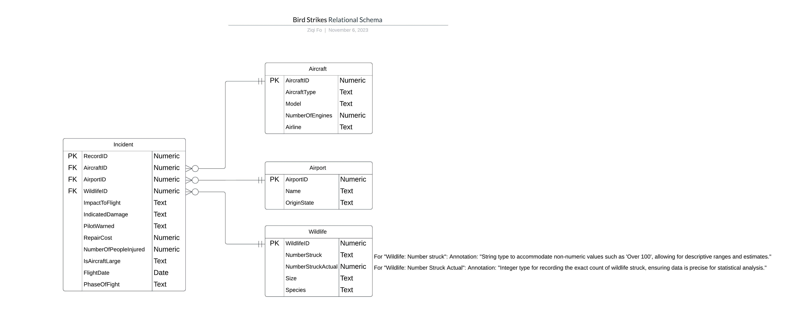

Group Members
Jichi Ge [[ge.jic\@northeastern.edu](mailto:ge.jic@northeastern.edu){.email}]
Wei Song [[song.wei1\@northeastern.edu](mailto:song.wei1@northeastern.edu){.email}]
Yu Swe Zin Aung [[yuswezinaung.y\@northeastern.edu](mailto:yuswezinaung.y@northeastern.edu){.email}]
Ziqi Fo [[fo.z\@northeastern.edu](mailto:fo.z@northeastern.edu){.email}]


***



***

Read csv file

```{r}
library(DBI)
library(RMySQL)
library(dplyr)
library(ggplot2)
library(RColorBrewer)


fpath = "E:/temp/Database_GroupProject_1/Database_GroupProject_1/"
dbFile = "BirdStrikesData.csv"
fullPath = paste0(fpath, dbFile)
birdStrikesData <- read.csv(fullPath)
```

```{r}
colnames(birdStrikesData)
```

Data from csv

```{r}
head(birdStrikesData)
```

Number of Rows in csv file

```{r}
nrow(birdStrikesData)
```

remove row if aircraft type empty/null

```{r}
birdStrikesData <- birdStrikesData[!birdStrikesData$Aircraft..Type == "",]
```

remove row if Number of engines is not between 1 and 4

```{r}
birdStrikesData <- birdStrikesData[birdStrikesData$Aircraft..Number.of.engines. >= 1 &
                                   birdStrikesData$Aircraft..Number.of.engines. <= 4, ]
```

Number of Rows After Data Cleaning

```{r}
nrow(birdStrikesData)
```

Create AircraftID based on Aircraft columns

```{r}
birdStrikesData <- birdStrikesData %>%
  group_by(Aircraft..Type, Aircraft..Make.Model, Aircraft..Number.of.engines., Aircraft..Airline.Operator) %>%
  mutate(AircraftID=cur_group_id()) %>%
  ungroup
```

create AirportID based on Airport columns

```{r}
birdStrikesData <- birdStrikesData %>%
  group_by(Airport..Name, Origin.State) %>%
  mutate(AirportID=cur_group_id()) %>%
  ungroup
```

```{r}
birdStrikesData <- birdStrikesData %>%
  group_by(Wildlife..Number.struck, Wildlife..Number.Struck.Actual, Wildlife..Size, Wildlife..Species) %>%
  mutate(WildlifeID=cur_group_id()) %>%
  ungroup
```

```{r}
colnames(birdStrikesData)
```

Create Aircraft dataframe to import to db

```{r}
aircraftColumns = c('AircraftID', 'Aircraft..Type', 'Aircraft..Make.Model', 'Aircraft..Number.of.engines.', 'Aircraft..Airline.Operator')
AircraftDF <- birdStrikesData[aircraftColumns]
AircraftDF <- AircraftDF[!duplicated(AircraftDF), ]
```

```{r}
head(AircraftDF)
```

Create Airport dataframe to import to db

```{r}
airportColumns = c('AirportID', 'Airport..Name', 'Origin.State')
AirportDF <- birdStrikesData[airportColumns]
AirportDF <- AirportDF[!duplicated(AirportDF), ]
```

```{r}
head(AirportDF)
```

Create Wildlife dataframe to import to db

```{r}
wildlifeColumns = c('WildlifeID', 'Wildlife..Number.struck', 'Wildlife..Number.Struck.Actual', 'Wildlife..Size', 'Wildlife..Species')
wildlifeDF <- birdStrikesData[wildlifeColumns]
wildlifeDF <- wildlifeDF[!duplicated(wildlifeDF), ]
```

```{r}
head(wildlifeDF)
```

Create incident dataframe to import to db, we need to parse the flight
date to R date data type with a format, so that we can change to MySQl
compatible format

```{r}
incidentColumns = c('Record.ID', 'AircraftID', 'AirportID', 'WildlifeID', 'Effect..Impact.to.flight', 'FlightDate', 'Effect..Indicated.Damage', 
                    'When..Phase.of.flight', 'Cost..Total..', 'Number.of.people.injured', 'Is.Aircraft.Large.', 'Pilot.warned.of.birds.or.wildlife.')
incidentDF <- birdStrikesData[incidentColumns]
incidentDF$FlightDate <- format(as.Date(incidentDF$FlightDate, format="%m/%d/%Y"), '%Y-%m-%d %H:%M:%S')
incidentDF <- incidentDF[!duplicated(incidentDF), ]
```

```{r}
head(incidentDF)
```

Initiate MySQL database connection with username and password

```{r}
dbcon <- dbConnect(RMySQL::MySQL(), username="newuser", password="password123456")
summary(dbcon)
```

```{sql connection=dbcon}
CREATE DATABASE IF NOT EXISTS birdstrikedb
```

```{sql connection=dbcon}
USE birdstrikedb
```

```{sql connection=dbcon}
DROP TABLE IF EXISTS Incident;
```

```{sql connection=dbcon}
DROP TABLE IF EXISTS Aircraft;
```

```{sql connection=dbcon}
DROP TABLE IF EXISTS Airport;
```

```{sql connection=dbcon}
DROP TABLE IF EXISTS Wildlife;
```

```{sql connection=dbcon}
CREATE TABLE IF NOT EXISTS Airport (
    AirportID INT,
    Name VARCHAR(255) NOT NULL,
    OriginState VARCHAR(255) NOT NULL,
    PRIMARY KEY(AirportID)
);
```

```{sql connection=dbcon}
CREATE TABLE IF NOT EXISTS Wildlife (
    WildlifeID INT,
    NumberStruck VARCHAR(255) NOT NULL,
    NumberStruckActual INT NOT NULL,
    Size VARCHAR(255) NOT NULL,
    Species VARCHAR(255) NOT NULL,
     PRIMARY KEY (WildlifeID)
);
```

```{sql connection=dbcon}
CREATE TABLE IF NOT EXISTS Aircraft (
    AircraftID INT, 
    AircraftType VARCHAR(255) NOT NULL,
    Model VARCHAR(255) NOT NULL,
    NumberOfEngines INT NOT NULL CHECK (NumberOfEngines BETWEEN 1 AND 4),
    Airline VARCHAR(255) NOT NULL, 
    PRIMARY KEY (AircraftID)
);
```

```{sql connection=dbcon}
CREATE TABLE IF NOT EXISTS Incident (
    RecordID INT ,
    AircraftID INT,
    AirportID INT,
    WildlifeID INT,
    PhaseOfFlight TEXT CHECK(PhaseOfFlight IN ('Climb','Landing Roll','Approach','Take-off run','Descent','Taxi','Parked')),
    ImpactToFlight TEXT,
    IndicatedDamage TEXT,
    PilotWarned TEXT,
    RepairCost NUMERIC,
    NumberOfPeopleInjured INT,
    IsAircraftLarge BOOLEAN, -- Change data type
    FlightDate DATE,
    FOREIGN KEY (AircraftID) REFERENCES Aircraft(AircraftID),
    FOREIGN KEY (AirportID) REFERENCES Airport(AirportID),
    FOREIGN KEY (WildlifeID) REFERENCES Wildlife(WildlifeID),
    PRIMARY KEY (RecordID)
);
```

```{r}
dbListTables(dbcon)
```

Create Airport Data

Map dataframe columns to database column

```{r}
names(AirportDF)[names(AirportDF) == 'Airport..Name'] <- 'Name'
names(AirportDF)[names(AirportDF) == 'Origin.State'] <- 'OriginState'
```

Column name of AirPort DataFrame

```{r}
names(AirportDF)
```

Write to each table

```{r}
dbWriteTable(dbcon, name="airport", value=AirportDF, append=TRUE, row.names=FALSE)
```

Create aircraft Data Map dataframe columns to database column

```{r}
names(AircraftDF)[names(AircraftDF) == 'Aircraft..Type'] <- 'AircraftType'
names(AircraftDF)[names(AircraftDF) == 'Aircraft..Make.Model'] <- 'Model'
names(AircraftDF)[names(AircraftDF) == 'Aircraft..Number.of.engines.'] <- 'NumberOfEngines'
names(AircraftDF)[names(AircraftDF) == 'Aircraft..Airline.Operator'] <- 'Airline'

AircraftDF
```

Write to each table

```{r}
dbWriteTable(dbcon, name="aircraft", value=AircraftDF, append=TRUE, row.names=FALSE)
```

Create wildlife Data

Map dataframe columns to database column

```{r}
names(wildlifeDF)[names(wildlifeDF) == 'Wildlife..Number.struck'] <- 'NumberStruck'
names(wildlifeDF)[names(wildlifeDF) == 'Wildlife..Number.Struck.Actual'] <- 'NumberStruckActual'
names(wildlifeDF)[names(wildlifeDF) == 'Wildlife..Size'] <- 'Size'
names(wildlifeDF)[names(wildlifeDF) == 'Wildlife..Species'] <- 'Species'
```

Write to each table

```{r}
dbWriteTable(dbcon, name="wildlife", value=wildlifeDF, append=TRUE, row.names=FALSE)
```

Create incident Data Map dataframe columns to database column

```{r}
names(incidentDF)[names(incidentDF) == 'Record.ID'] <- 'RecordID'
names(incidentDF)[names(incidentDF) == 'Effect..Impact.to.flight'] <- 'ImpactToFlight'
names(incidentDF)[names(incidentDF) == 'FlightDate'] <- 'FlightDate'
names(incidentDF)[names(incidentDF) == 'Effect..Indicated.Damage'] <- 'IndicatedDamage'
names(incidentDF)[names(incidentDF) == 'When..Phase.of.flight'] <- 'PhaseOfFlight'
names(incidentDF)[names(incidentDF) == 'Cost..Total..'] <- 'RepairCost'
names(incidentDF)[names(incidentDF) == 'Number.of.people.injured'] <- 'NumberOfPeopleInjured'
names(incidentDF)[names(incidentDF) == 'Is.Aircraft.Large.'] <- 'IsAircraftLarge'
names(incidentDF)[names(incidentDF) == 'Pilot.warned.of.birds.or.wildlife.'] <- 'PilotWarned'
```

Column name of Incident DataFrame

```{r}
colnames(incidentDF)
```

```{r}
head(incidentDF[order(incidentDF$RecordID),])
```

Write to each table

```{r}
dbWriteTable(dbcon, name="incident", value=incidentDF, append=TRUE, row.names=FALSE)
```

#find the number of bird strike incidents for each airline upon take-off
or climb

```{sql connection=dbcon}
SELECT a.Airline, COUNT(*) AS NumIncidents
FROM Incident i
JOIN Aircraft a ON i.AircraftID = a.AircraftID
WHERE i.PhaseOfFlight IN ('Take-off', 'Climb')
GROUP BY a.Airline
ORDER BY NumIncidents DESC;
```

#find the airports that had the most bird strike incidents

```{sql connection=dbcon}
SELECT 
    ap.Name AS AirportName,
    COUNT(inc.AirportID) AS NumberOfIncidents
FROM 
    Incident inc
INNER JOIN 
    Airport ap ON inc.AirportID = ap.AirportID
GROUP BY 
    inc.AirportID
ORDER BY 
    NumberOfIncidents DESC
LIMIT 10; -- Show top 10 airports with the most incidents

```

#find the number of bird strike incidents by year.

```{sql connection=dbcon}

SELECT 
    YEAR(FlightDate) AS Year,
    COUNT(*) AS NumberOfIncidents
FROM 
    Incident
GROUP BY 
    YEAR(FlightDate)
ORDER BY 
    Year;

```

```{sql connection=dbcon}
DROP VIEW IF EXISTS NumberOfIncidentCompare;
```

```{sql connection=dbcon}
CREATE VIEW NumberOfIncidentCompare 
AS
SELECT Year, PhaseOfFlight, COUNT(*) AS NumberOfIncidents
              FROM (
                  SELECT YEAR(FlightDate) AS Year,
                         CASE
                             WHEN PhaseOfFlight IN ('Take-off run', 'Climb') THEN 'Take-off/Climb'
                             WHEN PhaseOfFlight IN ('Descent', 'Landing Roll', 'Approach') THEN 'Descent/Approach/Landing'
                             ELSE 'Other'
                         END AS PhaseOfFlight
                  FROM Incident
                  WHERE YEAR(FlightDate) BETWEEN 2008 and 2011
              ) AS BirdStrikeByYear
              GROUP BY Year, PhaseOfFlight
              ORDER BY Year, PhaseOfFlight;

```

```{r}
sql_query <- "SELECT * FROM NumberOfIncidentCompare;"
result <- dbGetQuery(dbcon, sql_query)
```
#We can see that in 2009, the number of incident increased a lot. 
From 2009 to 2011, the number of incident slowly decreased.
There are more incidents happen in 2011 than in 2008 in all phase of the flight.
```{r}
custom_colors <- brewer.pal(n = 3, name = "Blues")

ggplot(result, aes(x = Year, y = NumberOfIncidents, fill = PhaseOfFlight)) +
  geom_bar(stat = "identity", position = "dodge") +
  labs(title = "Bird Strikes by Year and Phase of Flight",
       x = "Year",
       y = "Number of Bird Strikes") + theme_classic() +
  scale_fill_manual(values = custom_colors) 
```


#It is almost doubled the chance of the flight getting hit by bird during 
Descent/Approach/Landing than during Take-off/Climb.
The relative ratio of the phase of flight during incident is stable.
```{r}
unique_years <- unique(result$Year)
custom_colors <- brewer.pal(n = 3, name = "Blues")
for (year in unique_years) {
  year_data <- subset(result, Year == year)
  pie_chart <- ggplot(year_data, aes(x = "", y = NumberOfIncidents, fill = PhaseOfFlight)) +
    geom_bar(stat = "identity") +
    coord_polar(theta = "y") +
    theme_void() +  
    geom_text(aes(label = scales::percent(NumberOfIncidents / sum(NumberOfIncidents))), 
              position = position_stack(vjust = 0.5)) +
    labs(title = paste("Phase of Flight For Year", year))+ scale_fill_manual(values = custom_colors)
  
  
  
  print(pie_chart)
  
}
```

#There is an incident with an ID 200011

```{sql connection=dbcon}

SELECT * FROM `incident`
WHERE `RecordID` = 200011;
```

```{sql connection=dbcon}

DROP PROCEDURE IF EXISTS `delete_bird_strike_by_id`;
```

#create a stored procedure that can delete with an input of RecordID
from the table incident

```{sql connection=dbcon}
    

CREATE PROCEDURE `delete_bird_strike_by_id`(IN RecordID INT)
BEGIN
	 DELETE FROM `incident`
     WHERE `incident`.`RecordID` = RecordID;
END;


```

#call the stored procedure to delete the incident record with 
id 200011 from the table incident

```{sql connection=dbcon}
CALL delete_bird_strike_by_id(200011);
```

#incident ID of 200011 is deleted from the table incident

```{sql connection=dbcon}

SELECT * FROM `incident`
WHERE `RecordID` = 200011;
```

```{r}
dbDisconnect(dbcon)
```
